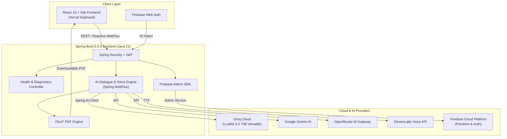

<div align="center">

# 🎙️ SpeakUp — AI English Speaking & Fluency Partner

<p align="center">
  <strong>Practice spoken English with real-time AI conversation, voice synthesis, and instant fluency feedback.</strong>
</p>

<p align="center">
  <a href="https://speakup-english.vercel.app"></a>
  
  
  
  
  
  
</p>

---

[Explore Features](#-key-features) •
[Architecture](#-system-architecture) •
[Tech Stack](#-tech-stack) •
[Getting Started](#-getting-started) •
[Environment Variables](#-environment-variables) •
[API Reference](#-api-endpoints)

---

</div>

## 🌟 Overview

**SpeakUp** is an intelligent, full-stack language training platform engineered to help learners master spoken English. Combining conversational AI LLMs (Groq Llama 3.3, Google Gemini, OpenRouter) with ultra-realistic text-to-speech (ElevenLabs), SpeakUp provides interactive speaking sessions, real-time grammar and pronunciation evaluation, and downloadable progress reports.

---

## ⚡ Key Features

- **🗣️ Natural Conversational AI**: Engaging voice & text roleplays powered by ultra-low-latency models (LLaMA 3.3 70B via Groq, Gemini & OpenRouter).
- **🔊 Realistic Voice Interaction**: Natural speech synthesis and auditory feedback powered by ElevenLabs.
- **📊 Real-time Grammar & Fluency Analysis**: Instant grammatical corrections, vocabulary enhancements, and CEFR-level speaking metrics.
- **🔐 Secure Authentication**: Firebase Auth + stateless JWT token architecture with Spring Security.
- **📄 Comprehensive PDF Reports**: Detailed fluency diagnostic reports exported dynamically via iText7.
- **⚡ Reactive & Non-Blocking**: High-throughput Spring WebFlux asynchronous pipelines built for real-time AI interactions.

---

## 🏗️ System Architecture



---

## 💻 Tech Stack

### Backend
- **Language**: Java 21 (LTS)
- **Framework**: Spring Boot 3.4.3
- **AI Integration**: Spring AI (v1.0.0 BOM), OpenAI Starter (configured for Groq LLaMA-3.3-70b-versatile)
- **Security**: Spring Security (Stateless filter chain, CORS configuration, JJWT 0.12.6)
- **Reactive Engine**: Spring WebFlux (Project Reactor)
- **Database & Auth**: Firebase Admin SDK 9.3.0
- **Document Generation**: iText7 PDF Suite (8.0.4)
- **Build Tool**: Apache Maven

### Frontend
- **Framework**: React 19
- **Bundler**: Vite 8 with HMR
- **Authentication**: Firebase Client SDK
- **State**: Redux Toolkit + React Router v6
- **Styling**: Tailwind CSS v4, config-less — design tokens in `@theme` inside `src/index.css`
- **Deployment**: Vercel

---

## 🎨 Design System

The UI follows one specification: **[`speakup-frontend/DESIGN_SYSTEM.md`](speakup-frontend/DESIGN_SYSTEM.md)**.
Vercel-dashboard aesthetic — pure black, flat, monochrome, borders instead of shadows.
Read it before changing any `.jsx` or `.css` file; it is the source of truth, and most of
its rules are machine-enforced:

```bash
cd speakup-frontend && npm run verify
```

`lint` blocks banned imports, `check:design` blocks banned utility classes, `build` must
pass. AI agents are pointed at the same document by [`CLAUDE.md`](CLAUDE.md) and
[`AGENTS.md`](AGENTS.md).

---

## 📁 Repository Structure

```text
speakup-english/
├── speakup-backend/               # Spring Boot 3.4.3 Backend
│   ├── src/main/java/com/speakup/backend/
│   │   ├── BackendApplication.java
│   │   ├── agents/                # AI Agent prompts & pipelines
│   │   ├── common/                # Shared utilities, exceptions, DTOs
│   │   ├── config/                # Security, Firebase, CORS & Health configs
│   │   ├── controllers/           # REST endpoints
│   │   ├── models/                # Domain models & entities
│   │   └── services/              # Business logic & AI clients
│   ├── src/main/resources/
│   │   └── application.yaml       # Spring properties with dynamic .env imports
│   ├── .env                       # Backend secrets (ignored by git)
│   ├── .env.example               # Backend environment template
│   └── pom.xml                    # Maven dependencies
│
└── speakup-frontend/              # React 19 + Vite Frontend
    ├── src/
    │   ├── api/                   # axios instance + interceptors
    │   ├── assets/                # Icons and branding
    │   ├── components/            # Navbar + ui/ (legacy, ProfileSetup only)
    │   ├── hooks/                 # useQuiz
    │   ├── pages/                 # Login, ProfileSetup, Quiz, Home, Settings, Admin
    │   ├── store/                 # Redux Toolkit authSlice
    │   ├── App.jsx                # Routes and guards
    │   ├── index.css              # Tailwind v4 @theme design tokens
    │   └── main.jsx               # Entry point
    ├── scripts/
    │   └── check-design.mjs       # Design-system class checker (npm run check:design)
    ├── DESIGN_SYSTEM.md           # UI source of truth — read before any design work
    ├── .env                       # Frontend environment config
    ├── .env.example               # Frontend environment template
    ├── eslint.config.js           # Lint + banned-import guard
    ├── package.json               # Node dependencies
    └── vite.config.js             # Vite configuration
```

---

## 🚀 Getting Started

### Prerequisites

Ensure the following runtimes are installed on your machine:
- **Java**: JDK 21+ (`java --version`)
- **Maven**: 3.9+ (`mvn -version`)
- **Node.js**: 18+ (`node --version`) and **npm** (`npm --version`)
- A **Firebase** project configured with Authentication and Firestore

---

### 1. Clone the Repository

```bash
git clone https://github.com/kanhaiya209/speakup-english.git
cd speakup-english
```

---

### 2. Backend Setup (`speakup-backend`)

1. **Navigate to the backend directory**:
   ```bash
   cd speakup-backend
   ```

2. **Configure Environment Variables**:
   Create a `.env` file from the provided example:
   ```bash
   cp .env.example .env
   ```
   Fill in your API keys (see [Environment Variables](#-environment-variables)).

3. **Build and Run**:
   ```bash
   mvn clean spring-boot:run
   ```

   The backend server will start on `http://localhost:8080`.
   Verify the health status:
   ```bash
   curl http://localhost:8080/api/health
   # Response: {"status":"UP","app":"SpeakUp Backend","version":"1.0.0"}
   ```

---

### 3. Frontend Setup (`speakup-frontend`)

1. **Navigate to the frontend directory**:
   ```bash
   cd ../speakup-frontend
   ```

2. **Install Dependencies**:
   ```bash
   npm install
   ```

3. **Configure Environment Variables**:
   Create a `.env` file:
   ```bash
   cp .env.example .env
   ```
   Add your Firebase client credentials.

4. **Start the Development Server**:
   ```bash
   npm run dev
   ```

   Open `http://localhost:5173` in your browser to interact with the application.

---

## 🔑 Environment Variables

### Backend (`speakup-backend/.env`)

| Variable | Description |
|---|---|
| `GROQ_API_KEY` | API Key for Groq cloud (LLaMA 3.3 70B Versatile) |
| `GEMINI_API_KEY` | Google Gemini AI API Key |
| `OPENROUTER_API_KEY` | OpenRouter Multi-LLM API Gateway Key |
| `ELEVENLABS_API_KEY` | ElevenLabs Text-to-Speech API Key |
| `FIREBASE_PROJECT_ID` | Firebase Project Identifier (`speakup-english-ed922`) |
| `JWT_SECRET` | 64+ char cryptographic secret for signing session tokens |

### Frontend (`speakup-frontend/.env`)

| Variable | Description |
|---|---|
| `VITE_API_BASE_URL` | Backend base URL (`http://localhost:8080`) |
| `VITE_FIREBASE_API_KEY` | Firebase Web API Key |
| `VITE_FIREBASE_AUTH_DOMAIN` | Firebase Authentication Domain |
| `VITE_FIREBASE_PROJECT_ID` | Firebase Project ID |
| `VITE_FIREBASE_STORAGE_BUCKET`| Firebase Cloud Storage Bucket |
| `VITE_FIREBASE_MESSAGING_SENDER_ID` | Firebase Messaging Sender ID |
| `VITE_FIREBASE_APP_ID` | Firebase Web Application ID |

---

## 📡 API Endpoints

| Method | Endpoint | Access | Description |
|---|---|---|---|
| `GET` | `/api/health` | Public | Backend health diagnostic & app status |
| `GET` | `/actuator/health` | Public | Spring Boot Actuator health status |
| `POST` | `/api/auth/register` | Public | User registration via Firebase ID token |
| `POST` | `/api/auth/login` | Public | User authentication & JWT issuance |
| `POST` | `/api/chat/message` | Authenticated | Send user audio/text & receive AI response |
| `GET` | `/api/reports/download`| Authenticated | Export fluency assessment as PDF |

---

## 🗺️ Roadmap

- [x] Initial Spring Boot 3.4.3 & React 19 architecture setup
- [x] Spring AI + Groq LLaMA 3.3 inference pipeline integration
- [x] Firebase Admin & Security authentication filter chain
- [x] Native `.env` secret loading with fail-safe property fallbacks
- [ ] Real-time WebRTC / WebSocket audio streaming for duplex voice sessions
- [ ] Speech-to-Text pronunciation scoring and syllable stress detection
- [ ] Interactive CEFR-graded conversation scenario challenges
- [ ] Dark/Light mode theme customization in UI

---

## 🤝 Contributing

Contributions are welcome! If you'd like to improve SpeakUp:
1. Fork the repository
2. Create your feature branch (`git checkout -b feature/AmazingFeature`)
3. **If your change touches the UI, read [`speakup-frontend/DESIGN_SYSTEM.md`](speakup-frontend/DESIGN_SYSTEM.md) first**
4. Run `npm run verify` in `speakup-frontend/` — lint, design check and build must pass
5. Commit your changes (`git commit -m 'Add some AmazingFeature'`)
6. Push to the branch (`git push origin feature/AmazingFeature`)
7. Open a Pull Request

---

## 📄 License

Distributed under the MIT License. See `LICENSE` for more information.

<div align="center">
  <sub>Built with ❤️ for English learners worldwide.</sub>
</div>
